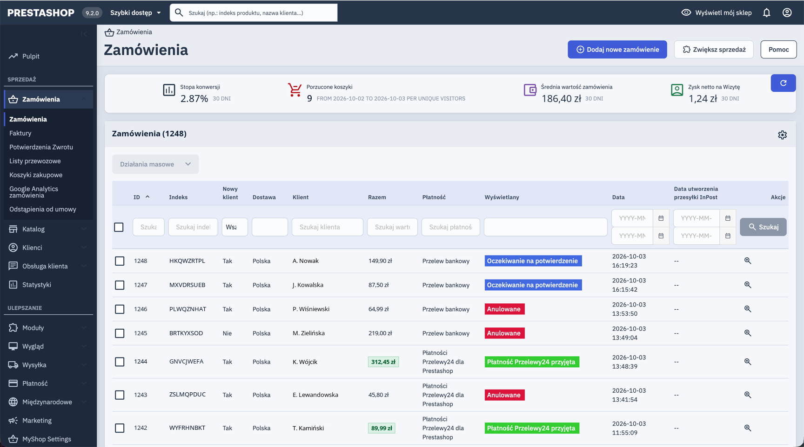

<p align="center">
  
</p>

<h1 align="center">Modern Back Office for PrestaShop 9</h1>

<p align="center">
  <strong>Give your PrestaShop admin panel a calm, modern look in under a minute.</strong><br>
  One stylesheet. No JavaScript. No template overrides. No database changes.
</p>

<p align="center">
  <a href="https://github.com/kamilchlebek/psmodernbackoffice/releases/latest"></a>
  <a href="https://github.com/kamilchlebek/psmodernbackoffice/releases"></a>
  
  <a href="LICENSE"></a>
</p>

<p align="center">
  <a href="https://github.com/kamilchlebek/psmodernbackoffice/releases/latest/download/psmodernbackoffice.zip"><b>⬇️ Download psmodernbackoffice.zip</b></a>
</p>

<p align="center">
  
  <br><sub>Orders list with Modern Back Office enabled (sample data)</sub>
</p>

---

## Why?

You spend hours a day in the back office. The default PrestaShop 9 theme is functional, but it is also flat, very white and low on contrast, and the status labels are hard to tell apart at a glance.

**Modern Back Office** keeps every screen exactly where it is and only changes how it looks:

- 🎨 **Soft slate background** instead of plain white, so cards and panels stand out and long sessions are easier on the eyes.
- 🌙 **Dark sidebar** with a clear blue marker on the active menu item.
- 🔵 **One consistent blue accent** for buttons, links, focus rings, checkboxes and active tabs.
- 🚦 **Readable status colors.** Success, warning, danger and info badges and alerts are tuned to a contrast of at least 5.5:1, so you can scan an order list in a second.
- 📋 **Easier-to-read tables** with blue-tinted headers, zebra stripes and hover rows in both legacy lists and the new Symfony grids.
- 📊 **A tidied-up dashboard** with compact tabs, cleaner KPI tiles, chart axes in palette colors and no wrapping in the recent orders table.
- ✨ **Small touches** such as rounded corners, soft shadows, smoother dropdowns and hover feedback on buttons. It also respects `prefers-reduced-motion`.

## Why is it safe?

| | |
|---|---|
| **CSS only** | A single file, `views/css/modern.css`, is added after the core `theme.css`. |
| **Zero core changes** | It doesn't override templates, add JavaScript or touch the database. |
| **Fully reversible** | Disable or uninstall the module and the default look returns instantly. |
| **Works everywhere** | Covers both the Symfony pages and the legacy controller pages. |
| **Built on PS9 tokens** | Remaps the official PrestaShop 9 UI Kit variables (`--cdk-*`), so new core screens pick up the palette automatically. |
| **Upgrade friendly** | Nothing to merge or redo after a PrestaShop update. |

## Installation

1. Download **[psmodernbackoffice.zip](https://github.com/kamilchlebek/psmodernbackoffice/releases/latest/download/psmodernbackoffice.zip)** from the latest release.
2. In your back office, go to **Modules → Module Manager → Upload a module**.
3. Drop the zip file and click **Install**.
4. Refresh the page. That's it, there is nothing to configure.

<details>
<summary>Manual installation (FTP / SSH)</summary>

```bash
cd /path/to/prestashop/modules
curl -L -o psmodernbackoffice.zip \
  https://github.com/kamilchlebek/psmodernbackoffice/releases/latest/download/psmodernbackoffice.zip
unzip psmodernbackoffice.zip && rm psmodernbackoffice.zip
php ../bin/console prestashop:module install psmodernbackoffice
```

</details>

## Requirements

- PrestaShop **9.0** or newer
- Nothing else. There are no Composer dependencies and no build step.

## Customization

The whole palette is a set of CSS custom properties at the top of [`views/css/modern.css`](views/css/modern.css). Change a few hex values to match your brand:

```css
html:root {
    --psm-accent: #3f5bd6;       /* buttons, links, focus rings */
    --psm-accent-dark: #2f47b0;  /* hover state */
    --psm-bg: #dde3ec;           /* page background */
    --psm-nav-bg: #1e293b;       /* sidebar */
    /* ...and more for surfaces, tables and statuses */
}
```

> **Tip:** Keep your changes in a fork, or note them down. Updating the module replaces `modern.css`.

## FAQ

**Does it slow down the back office?**
No. It adds one small, cacheable stylesheet. The URL includes the file's modification time, so browsers re-download it only when it changes.

**Does it affect my storefront?**
No. The stylesheet is attached through the `actionAdminControllerSetMedia` hook, which runs only in the admin panel.

**Will it work with PrestaShop 8 or 1.7?**
It's built for and tested on PrestaShop 9, which has the `--cdk-*` design tokens that the module relies on. Older versions are not supported.

**Something looks off on a third-party module page.**
Please [open an issue](https://github.com/kamilchlebek/psmodernbackoffice/issues) with a screenshot and the module name.

## Contributing

Issues and pull requests are welcome. The module is a single CSS file, so contributing is easy:

1. Fork the repo and clone it into your `modules/` directory.
2. Edit `views/css/modern.css` and refresh the back office. No build step is needed.
3. Open a pull request with before/after screenshots.

## Releasing (maintainers)

Bump `$this->version` in `psmodernbackoffice.php`, commit, then push a matching tag:

```bash
git tag v1.0.1 && git push origin v1.0.1
```

GitHub Actions checks that the tag matches the module version, builds `psmodernbackoffice.zip` and publishes it as a release asset.

## Changelog

### 1.0.0
- First public release.

## License

[MIT](LICENSE) © Kamil Chlebek

---

<p align="center">If this module makes your day in the back office a bit nicer, please consider giving it a ⭐</p>
